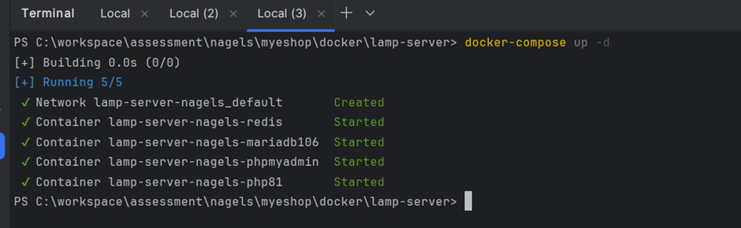
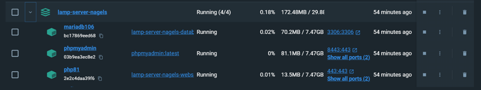
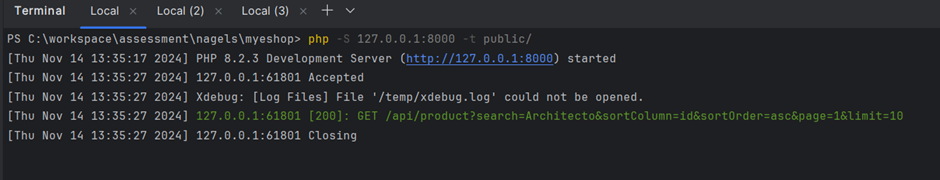
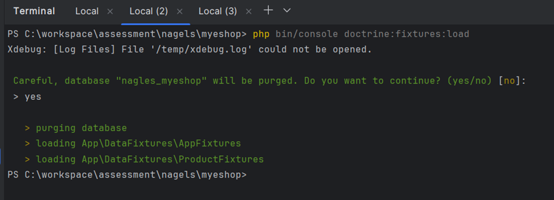
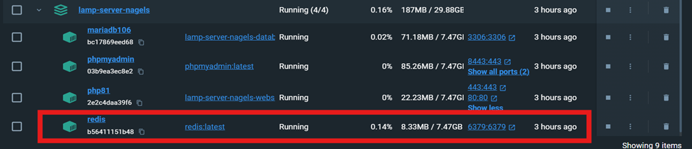
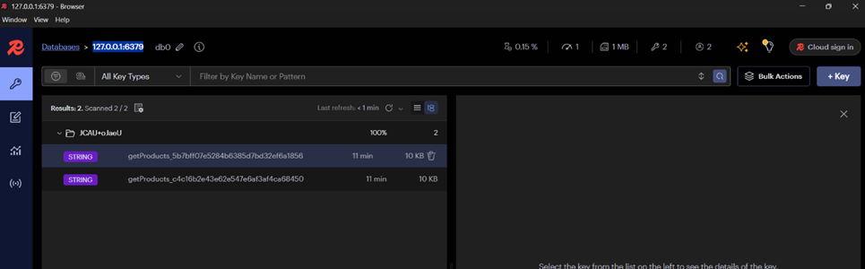

# Myeshop Nagels Task
### System Requirements

- PHP 8.1 or higher
- MySQL 8.0 or higher
- Symfony 6.4 or higher
- Composer 2.5 or higher
- Symfony CLI 5.9 or higher (OPTIONAL)
- Docker

###   Note
- .env file already configured for symfony and docker.

# Docker

1. Navigate to the "docker" directory within the project files.

2. Open a command line or terminal in "docker" -> "lamp-server".

3. Start the Docker containers by executing the command:

   `docker-compose up -d`

   

4. Verify that all containers are running, either via the command line or by using Docker Desktop if on Windows.
   

# Symfony Project Setup

1. Clone the repository to your desired directory:\
   <https://github.com/vrushalrt/myeshop-nagels-task.git>

2. Open a terminal or command prompt and navigate to the project directory.

3. Start the Symfony server with the command:\
   `php -S 127.0.0.1:8000 -t public/`.
   

4. If necessary, populate the database tables using Symfony fixtures:\
   `php bin/console doctrine:fixtures:load`.
   

# API Endpoints

**NOTE:** For optimal experience, use the Postman application.\
**Postman Documentation:**
<https://documenter.getpostman.com/view/1965482/2sAY55ad5L>

### Search API Endpoint

**URL:**
<http://127.0.0.1:8000/api/product?search=Architecto&sortColumn=id&sortOrder=asc&page=1&limit=10>

### Download CSV

**URL:**
<http://127.0.0.1:8000/api/product/export?search=Architecto&sortColumn=id&sortOrder=asc&page=1&limit=10>

# Cache

1. This project uses Redis to cache frequent response data with a 1-hour expiration limit.\
   Ensure the Redis container is running in Docker.
   

2. To monitor the Redis cache, use the Redis Insight application and connect to IP 127.0.0.1:6379.

   <https://redis.io/insight/>
   
